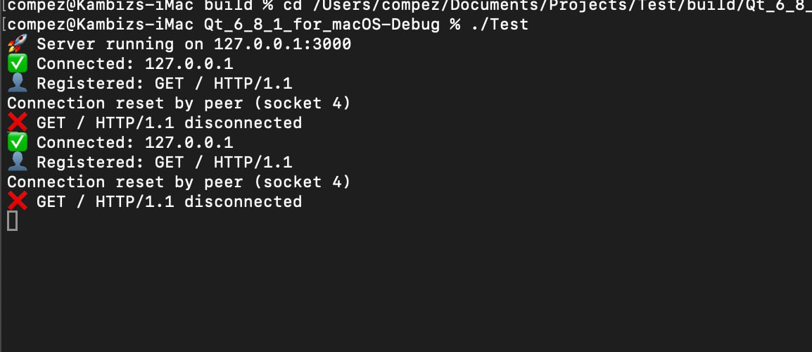

# TCP Chat (C++)


A simple TCP-based chat server and client written in C++. This project was originally created by **Max Base**, and later ported to C++ by **Kambiz Asadzade**.



## Features

- Single room
- Multi-user chat support
- TCP-based communication
- Simple and lightweight
- Easy to set up and use

## Requirements

- C++22
- CMake 3.10+
- A POSIX-compliant system (Linux/macOS) or Windows with Winsock

## Installation & Build

### Clone the Repository

```sh
git clone https://github.com/BaseMax/TCP-Chat-CPP.git
cd TCP-Chat-CPP
```

### Build with CMake

```sh
mkdir build && cd build
cmake ..
make
```

### Running the Server

```sh
./server <port>
```

### Running the Client

Feel free to use telnet or putty or other clients to test it.

## Usage

1. Start the server on a machine with a specified port.
2. Connect one or more clients using a client program.
3. Clients can send messages to the server, which broadcasts them to all connected users.

## License

This project is licensed under the [MIT License](LICENSE).

## Authors

- **Kambiz Asadzadeh** - Ported to C++
- **Max Base** - Original Developer

## Contribution

Contributions are welcome! Feel free to open an issue or submit a pull request.

## Contact

For any questions or suggestions, feel free to reach out via GitHub issues.

Copyright 2025, Max Base
